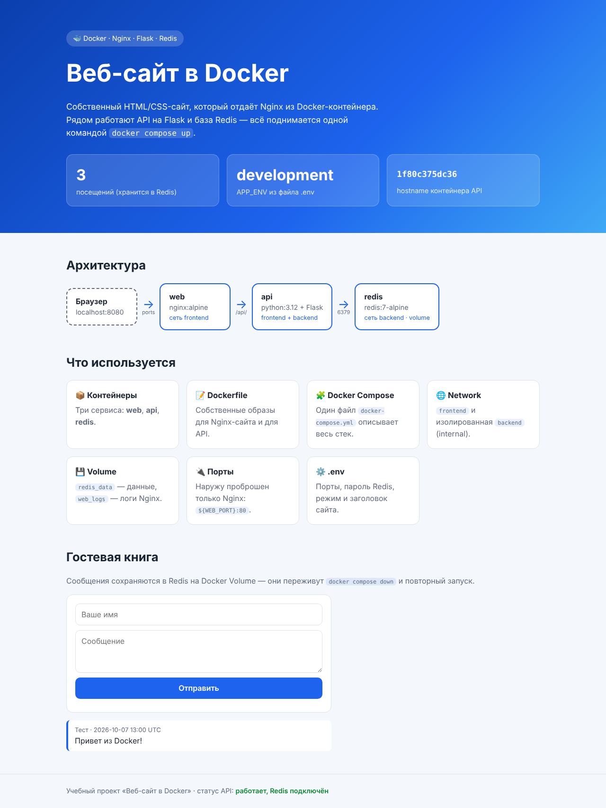

# 🐳 Веб-сайт в Docker

Учебный проект: **Nginx + собственный HTML/CSS-сайт + Dockerfile**, развёрнутый в виде
мульти-контейнерного приложения через Docker Compose.



## Что реализовано

| № | Требование | Где смотреть |
|---|------------|--------------|
| 1 | 2–3 Docker-контейнера | 3 сервиса: `web` (Nginx), `api` (Python/Flask), `redis` |
| 2 | Dockerfile | [`web/Dockerfile`](web/Dockerfile), [`api/Dockerfile`](api/Dockerfile) |
| 3 | Docker Compose | [`docker-compose.yml`](docker-compose.yml) |
| 4 | Docker Network | сети `frontend` (web ↔ api) и `backend` (api ↔ redis, `internal: true`) |
| 5 | Docker Volume | `redis_data` — данные Redis, `web_logs` — логи Nginx |
| 6 | Проброс портов | `${WEB_PORT}:80` — наружу открыт только Nginx |
| 7 | Переменные окружения `.env` | [`.env`](.env) / [`.env.example`](.env.example) |
| 8 | Демонстрация в браузере | http://localhost:8080 |
| 9 | README-инструкция | этот файл |

## Архитектура

```
 Браузер ──(порт 8080)──► web (nginx) ──/api/──► api (Flask) ──► redis
                          │                     │                 │
                          └──── сеть frontend ──┘                 │
                                                └── сеть backend ─┘ (internal)
                          volume: web_logs                volume: redis_data
```

- **web** — образ на базе `nginx:alpine`. Отдаёт статический сайт (`web/html`)
  и проксирует запросы `/api/*` в контейнер `api`. Конфигурация nginx собирается
  из шаблона `web/templates/default.conf.template`: при старте подставляются
  переменные `API_HOST` и `API_PORT`.
- **api** — образ на базе `python:3.12-slim`, Flask + Gunicorn. Эндпоинты:
  - `GET  /api/health` — состояние API и подключения к Redis;
  - `GET  /api/info` — заголовок сайта, `APP_ENV`, hostname контейнера;
  - `POST /api/visits` — счётчик посещений;
  - `GET/POST /api/messages` — гостевая книга.
- **redis** — официальный образ `redis:7-alpine` с паролем и AOF-сохранением
  на volume `redis_data`.

Сеть `backend` помечена как `internal`: Redis не имеет доступа в интернет и
недоступен из контейнера `web` — к нему может обратиться только `api`.

## Структура проекта

```
.
├── .env                  # переменные окружения (демо-значения)
├── .env.example          # шаблон переменных
├── docker-compose.yml    # описание всех сервисов, сетей и томов
├── web/
│   ├── Dockerfile
│   ├── templates/default.conf.template   # конфиг nginx
│   └── html/             # index.html, style.css, app.js, favicon.svg
├── api/
│   ├── Dockerfile
│   ├── app.py
│   └── requirements.txt
└── docs/screenshot.png
```

## Запуск

### Требования

- Docker Engine 20.10+ (или Docker Desktop)
- Docker Compose v2 (команда `docker compose`)

### Шаги

```bash
# 1. Клонировать репозиторий
git clone https://github.com/miniguts/traidin_techinc.git
cd traidin_techinc

# 2. (необязательно) поправить переменные окружения
#    .env уже есть с демо-значениями; шаблон — .env.example
cp .env.example .env

# 3. Собрать образы и запустить контейнеры в фоне
docker compose up -d --build

# 4. Проверить состояние (все три сервиса должны быть healthy)
docker compose ps
```

Открыть в браузере: **http://localhost:8080**
(порт задаётся переменной `WEB_PORT` в `.env`).

На странице видно: счётчик посещений из Redis, значение `APP_ENV` из `.env`,
hostname контейнера API и рабочую гостевую книгу.

### Переменные окружения

| Переменная | По умолчанию | Назначение |
|------------|--------------|------------|
| `COMPOSE_PROJECT_NAME` | `docker-site` | префикс имён контейнеров, сетей и томов |
| `WEB_PORT` | `8080` | порт на хосте для сайта |
| `SITE_TITLE` | `Веб-сайт в Docker` | заголовок сайта (отдаётся через API) |
| `API_PORT` | `5000` | внутренний порт API |
| `APP_ENV` | `development` | режим приложения, выводится на странице |
| `REDIS_PORT` | `6379` | внутренний порт Redis |
| `REDIS_PASSWORD` | `change_me_redis_pass` | пароль Redis |

> ⚠️ В реальных проектах `.env` с паролями не коммитят в репозиторий.
> Здесь он оставлен для удобства демонстрации.

После изменения `.env` перезапустите стек: `docker compose up -d`.

## Полезные команды

```bash
# Логи всех сервисов / одного сервиса
docker compose logs -f
docker compose logs -f api

# Проверка API из терминала
curl http://localhost:8080/api/health
curl -X POST http://localhost:8080/api/visits

# Сети и тома проекта
docker network ls | grep docker-site
docker volume ls  | grep docker-site
docker network inspect docker-site_backend

# Логи nginx, сохранённые в volume
docker compose exec web tail -n 20 /var/log/nginx/access.log

# Проверка изоляции: web не видит redis (сеть backend недоступна)
docker compose exec web wget -qO- -T2 http://redis:6379   # -> bad address 'redis'

# Зайти в Redis
docker compose exec redis redis-cli -a change_me_redis_pass --no-auth-warning   # пароль из .env
```

### Проверка Volume

```bash
docker compose down          # контейнеры удалены, тома остались
docker compose up -d         # счётчик и сообщения гостевой книги на месте
```

## Остановка

```bash
docker compose down          # остановить и удалить контейнеры и сети
docker compose down -v       # + удалить тома (данные Redis и логи будут стёрты)
```

## Возможные проблемы

- **`port is already allocated`** — порт 8080 занят. Поменяйте `WEB_PORT` в `.env`.
- **Страница открывается, но счётчик «×»** — API ещё стартует или Redis недоступен:
  `docker compose ps` и `docker compose logs api`.
